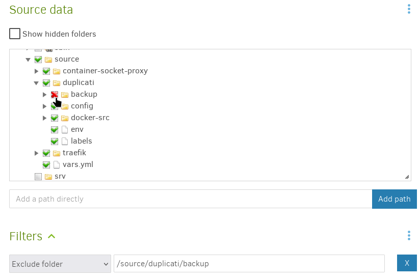

<!--
SPDX-FileCopyrightText: 2020 - 2024 MDAD project contributors
SPDX-FileCopyrightText: 2020 - 2024 Slavi Pantaleev
SPDX-FileCopyrightText: 2020 Aaron Raimist
SPDX-FileCopyrightText: 2020 Chris van Dijk
SPDX-FileCopyrightText: 2020 Dominik Zajac
SPDX-FileCopyrightText: 2020 Mickaël Cornière
SPDX-FileCopyrightText: 2022 François Darveau
SPDX-FileCopyrightText: 2022 Julian Foad
SPDX-FileCopyrightText: 2022 Warren Bailey
SPDX-FileCopyrightText: 2023 Antonis Christofides
SPDX-FileCopyrightText: 2023 Felix Stupp
SPDX-FileCopyrightText: 2023 Pierre 'McFly' Marty
SPDX-FileCopyrightText: 2024 - 2025 Suguru Hirahara

SPDX-License-Identifier: AGPL-3.0-or-later
-->

# Setting up Duplicati

This is an [Ansible](https://www.ansible.com/) role which installs [Duplicati](https://duplicati.com) to run as a [Docker](https://www.docker.com/) container wrapped in a systemd service.

Duplicati is a backup software that securely stores encrypted, incremental, compressed backups on local storage, cloud storage services and remote file servers. It works with standard protocols like FTP, SSH, WebDAV as well as popular services like Microsoft OneDrive, Amazon S3 (compatible) Object Storage, Google Drive, box.com, Mega, B2, and many others.

See the project's [documentation](https://docs.duplicati.com) to learn what Duplicati does and why it might be useful to you.

>[!NOTE]
> As the Duplicati instance runs as the Docker container, it is necessary to mount the directory which includes files to back up on the host machine. Note that it is not able for the container to access files **outside of the mounted directory**.
>
> If you wish to manage a backup of directories on the machine without such restriction, you might probably want to consider to install Duplicati directly on the host machine. See [this page on the official documentation](https://docs.duplicati.com/getting-started/installation) for details.

## Adjusting the playbook configuration

To enable Duplicati with this role, add the following configuration to your `vars.yml` file.

**Note**: the path should be something like `inventory/host_vars/mash.example.com/vars.yml` if you use the [MASH Ansible playbook](https://github.com/mother-of-all-self-hosting/mash-playbook).

```yaml
########################################################################
#                                                                      #
# duplicati                                                            #
#                                                                      #
########################################################################

duplicati_enabled: true

########################################################################
#                                                                      #
# /duplicati                                                           #
#                                                                      #
########################################################################
```

### Set the hostname

To enable the Duplicati instance you need to set the hostname as well. To do so, add the following configuration to your `vars.yml` file. Make sure to replace `example.com` with your own value.

```yaml
duplicati_hostname: "example.com"
```

After adjusting the hostname, make sure to adjust your DNS records to point the domain to your server.

**Note**: hosting Duplicati under a subpath (by configuring the `duplicati_path_prefix` variable) does not seem to be possible due to Duplicati's technical limitations.

### Mount a directory for files to backup

You can mount the directory by adding the following configuration to your `vars.yml` file:

```yaml
duplicati_source_path: /path/on/the/host
```

Make sure permissions and owner of the directory specified to `duplicati_source_path`.

### Set a password for the UI

You also need to set a log in password on the web UI by adding the following configuration to your `vars.yml` file:

```yaml
duplicati_environment_variable_duplicati__webservice_password: YOUR_WEBUI_PASSWORD_HERE
```

Replace `YOUR_WEBUI_PASSWORD_HERE` with your own value.

### Extending the configuration

There are some additional things you may wish to configure about the service.

Take a look at:

- [`defaults/main.yml`](../defaults/main.yml) for some variables that you can customize via your `vars.yml` file. You can override settings (even those that don't have dedicated playbook variables) using the `duplicati_environment_variables_additional_variables` variable

## Installing

After configuring the playbook, run the installation command of your playbook as below:

```sh
ansible-playbook -i inventory/hosts setup.yml --tags=setup-all,start
```

If you use the MASH playbook, the shortcut commands with the [`just` program](https://github.com/mother-of-all-self-hosting/mash-playbook/blob/main/docs/just.md) are also available: `just install-all` or `just setup-all`

## Usage

After running the command for installation, Duplicati becomes available at the specified hostname like `https://example.com`.

You can log in to the UI by inputting the password set to `duplicati_environment_variable_duplicati__webservice_password`.

On the UI you can add and edit a backup task, restore files from backups, and configure default backup settings, etc. See <https://docs.duplicati.com/getting-started/set-up-a-backup-in-the-ui> for the instruction to configure a backup task.

### Destination and Source Data settings

When configuring a backup task, it should be noted that the Duplicati instance is able to access read / write data on the host machine through the mounted directories only.

By default, directories for "Destination" and "Source Data" are mounted on the paths specified with `duplicati_backup_path` and `duplicati_source_path`, respectively. While `duplicati_backup_path` is set by this role, `duplicati_source_path` needs to be specified manually as stated above.

>[!NOTE]
> While system files and directories are visible on the UI for "Destination" and "Source Data" settings, they belong to the Docker container, not the host machine.

#### Destination setting

On the second step you can configure settings for backup destination (where to store backups).

If "Local folder or drive" is selected as the storage type on the configuration UI, **choose `backup` on the directories tree on "Folder path"**, so that backups can be shared with the host machine.

>[!NOTE]
> Inside the container is there a directory named "backups" as well (mind the last "s") — Make sure not to confuse them.

[](assets/destination.png)

#### Source Data setting

On the next step for Source Data setting, **choose `source` or directories inside it** as the backup source.

>[!WARNING]
> Choosing directories outside of it would just create an useless backup of data inside the Duplicati's Docker container, not of data on the mounted directory which belongs to the host machine.

If you include Duplicati's directory itself in the backup, make sure to exclude `backup` as it is used for storing backups if "Local folder or drive" is selected as the destination; including it would have those backups backed up again.

[](assets/source.png)

## Troubleshooting

### Check the service's logs

You can find the logs in [systemd-journald](https://www.freedesktop.org/software/systemd/man/systemd-journald.service.html) by logging in to the server with SSH and running `journalctl -fu duplicati` (or how you/your playbook named the service, e.g. `mash-duplicati`).
